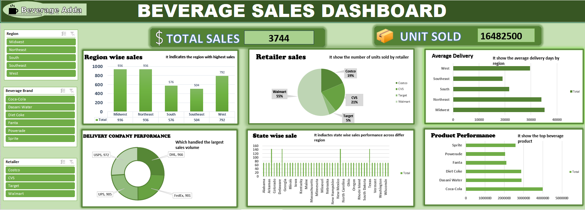

# 🥤 Beverage Sales Dashboard

An interactive **Microsoft Excel Dashboard** designed to analyze beverage sales performance across multiple regions, retailers, delivery companies, and products. This dashboard transforms raw sales data into actionable business insights through interactive visualizations and dynamic filtering.

---

# 📌 Project Overview

The **Beverage Sales Dashboard** provides a comprehensive view of sales performance by presenting key business metrics, regional sales distribution, retailer performance, delivery efficiency, and product analysis. The dashboard enables users to explore data using interactive slicers for better decision-making.

---
# 🖼️ Dashboard Preview

#  🎯 Project Objective

The objective of this project is to:

- 📊 Monitor overall sales performance.
- 🌍 Analyze regional sales distribution.
- 🛒 Evaluate retailer sales contribution.
- 🚚 Measure delivery performance.
- 🥤 Identify top-performing beverage products.
- 📈 Build an interactive Excel dashboard for business reporting.

---

#  📊 Dashboard Features

✅ Total Sales KPI

✅ Units Sold KPI

✅ Region-wise Sales Analysis

✅ Retailer Sales Distribution

✅ Average Delivery Analysis

✅ Delivery Company Performance

✅ State-wise Sales Analysis

✅ Product Performance Analysis

✅ Interactive Slicers
- Region
- Beverage Brand
- Retailer

---

#  📈 Key Performance Indicators (KPIs)

- 💰 Total Sales
- 📦 Units Sold
- 🌍 Highest Sales Region
- 🛒 Best Performing Retailer
- 🚚 Delivery Company Performance
- 🥤 Top Selling Beverage

---

#  🛠️ Tools & Technologies Used

- 📊 Microsoft Excel
- 📈 Pivot Tables
- 📉 Pivot Charts
- 🎛️ Interactive Slicers
- 🧮 Excel Formulas
- 🎨 Conditional Formatting
- 📋 Dashboard Design

---

 # 💡 Excel Skills Demonstrated

- ✔️ Data Cleaning
- ✔️ Data Analysis
- ✔️ Pivot Tables
- ✔️ Pivot Charts
- ✔️ Dashboard Development
- ✔️ Interactive Reporting
- ✔️ KPI Reporting
- ✔️ Business Data Visualization

---

# 📊 Business Insights

- 📍 Midwest recorded the highest regional sales.
- 🛒 Walmart contributed the highest retailer sales.
- 🚚 DHL handled one of the highest delivery volumes.
- 🥤 Coca-Cola emerged as one of the top-performing beverage products.
- 📦 Units Sold KPI helps measure overall sales volume.
- 🌍 Regional comparison identifies high and low-performing markets.
- 🎛️ Interactive slicers allow users to analyze data dynamically.
- 📈 The dashboard supports faster business decision-making.

---

# 👩‍💻 Author

**Ishika Sharma**

LinkedIn: www.linkedin.com/in/ishika-sharma-70435641b

GitHub: https://github.com/Ishikasharma2005/Beverage-Dashboard

Gmail: ishikasharmaa25@gmail.com
